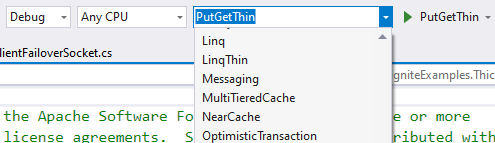
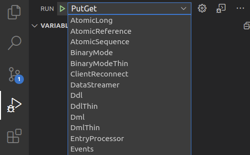
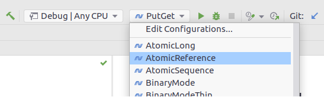
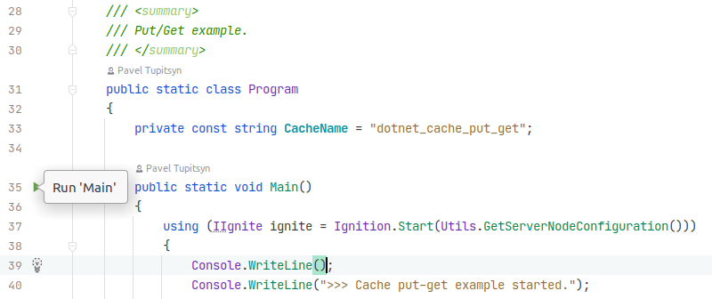

# GridGain.NET Examples

* Examples are grouped by Thick and Thin modes in corresponding folders.
* `Shared` project contains common code, such as configuration and model classes.
* `ServerNode` project is used to start Ignite server nodes.

# Requirements

* [.NET 8 SDK](https://dotnet.microsoft.com/download/dotnet-core)
* [JDK 17](https://adoptium.net/temurin/releases/?version=17) or later

Windows, Linux, and macOS are supported.

# Download Examples

* NuGet: 
  * `dotnet new install GridGain.Ignite.Examples`
  * `dotnet new gridgain-examples`  
* GridGain website: https://www.gridgain.com/products/software
* git: `git clone https://github.com/gridgain/gridgain --depth=1`, `cd ignite/modules/platforms/dotnet/examples`

# Run Examples

## Command Line

* Change to a specific example directory: `cd Thick/Cache/PutGet`
* `dotnet run`

Thin Client examples require one or mode Ignite server node, run this in a separate terminal window before starting the example:
* `cd ServerNode`
* `dotnet run`

## Visual Studio

* Open `Apache.Ignite.Examples.sln`
* Select an example on the Run toolbar and run

## VS Code

* Open current folder (from UI or with `code .` command)
* Open "Run" panel (`Ctrl+Shift+D` - default shortcut for `workbench.view.debug`)
* Select an example from the combobox on top and run

## Rider

* Open `Apache.Ignite.Examples.sln`
* Select an example on the Run toolbar and run

* Alternatively, open the example source code an run it using the sidebar icon

