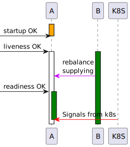
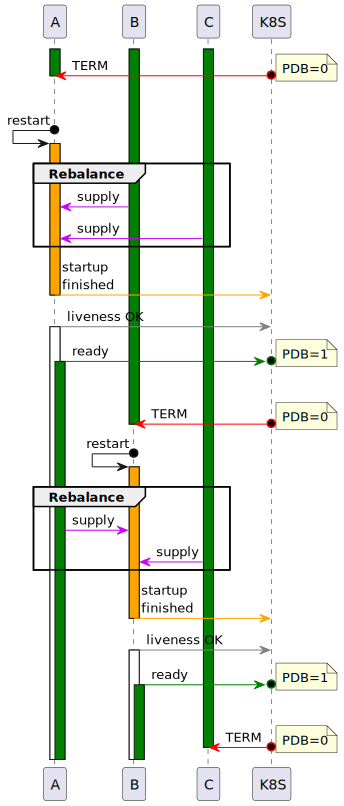

Check README.md first

K8S Use cases
=============

## Legend and glossary

- Orange vertical bars represents period of time when k8s polls __startup__ probe, 
  once it succeeds startup probe will be polled no more
- White vertical bars represents successful __liveness__ probe
- Green vertical bars represents successful __readiness__ probe. 
  If only green bar is displayed assume that liveness is also OK at the same time

__PDB__ - Pod disruption budget Quota for pod bouncing, i.e. if PDB=0, k8s won’t restart another pod until PDB become > 0. 
PDB increments when readiness probe of new pod starts to return true and decrements when readiness probe returns 
false (this can be due to restart or due to issues on the pod)

## Cases

### 1. Scale up cluster with new node A

With scaling up there's nothing extraordinary, we just start a new pod and add it to BLT, 
once initial rebalance finishes node A is ready to accept user traffic

### 2. Scale down in-memory cluster
Also straightforward

### 3. Rolling bounce of cluster with persistence

  
Since readiness probe of newcomer node always waits for initial rebalance k8s won’t send TERM signal to next pod until 
rebalance finishes. So no LP happens.

In case if we want to use dedicated Startup probe for that process will look like

### 4. Rolling bounce with backups and PDB = 2

Benefit of this approach highly depend on our ability to takeover rebalance supplying, 
if we are able to not start it from the very beginning it might make sense. 

### 5. Maintenance mode

In MM liveness probe should work as usual, but readiness should always return `false` in order to prevent routing 
user traffic to this node.

### 6. Activation of cluster (fresh or when auto-activation disabled)

Still not clear, in case if readiness returns `false` for inactive clusters (which might make sense), 
k8s won't allow outer traffic to reach the cluster. This means that it won't be possible to activate cluster 
from __thin clients__.